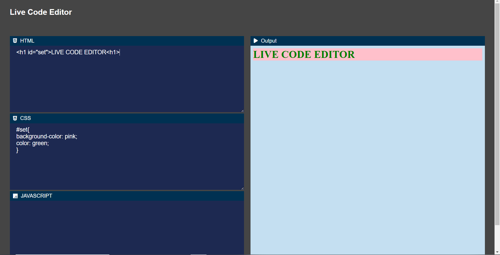

# LIVE CODE EDITOR
<ul>
    <li>The folder contains a live code editor containing three sections
    <li>The content is divided into two sections
         <ol>
         <li>Left: For insertion of code in it's specified coloumns
         <li>Righ: For the result of the code written in each sections
         </ol>
    <li>The code editor live runs
        <ol>
            <li>HTML
            <li>CSS
            <li>JAVASCRIPT
        </ol>
</ul>

# Attached screenshot of working project

